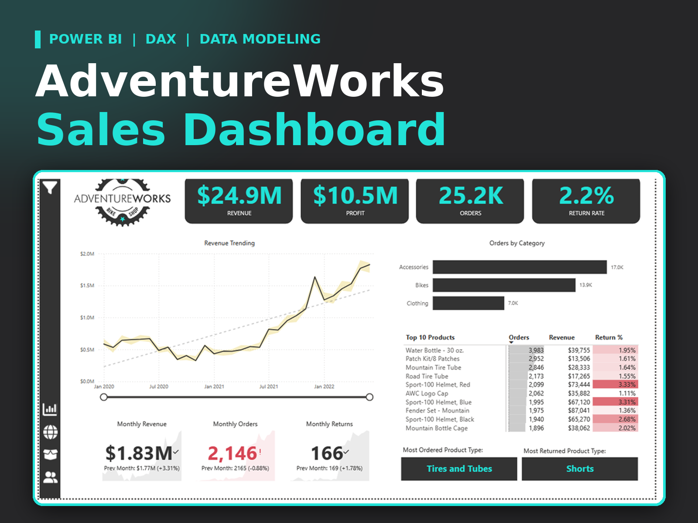
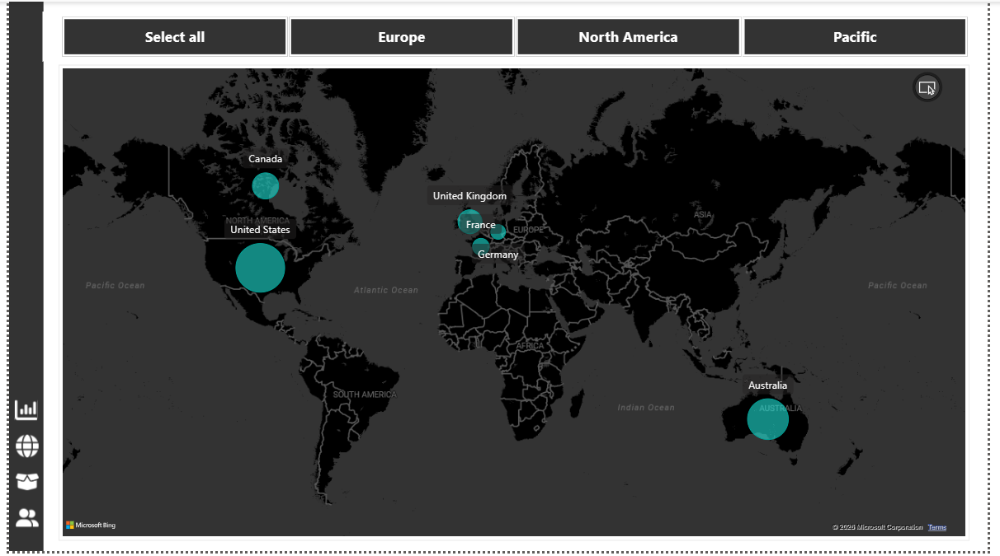

# AdventureWorks Sales, Product & Customer Insights Dashboard

  

  <b>Interactive Power BI dashboard for sales, product, customer, and regional performance analysis.</b>

## Project Overview

This project is a multi-page Power BI business intelligence solution built using the AdventureWorks dataset. It combines executive KPI reporting with detailed product, customer, and geographic analysis.

The report uses interactive navigation, slicers, drill-down analysis, and DAX-driven measures to explore business performance from different perspectives.

## Dashboard Pages

- Executive Dashboard
- Map Analysis
- Product Detail
- Customer Detail
- Q&A
- Decomposition Tree
- Key Influencers

## Key Analysis Areas

- Sales performance
- Product performance
- Customer analysis
- Regional and geographic performance
- KPI monitoring
- Interactive drill-down analysis
- Business-focused reporting

## Skills Used

**Power BI | DAX | Power Query | Data Modeling | Data Visualization | Sales Analytics | Customer Analytics**

## Dashboard Preview

### Executive Dashboard

### Product Details

### Customer Details

### Map Analysis

## Repository Files

- **Project_Cover.png** — project cover image
- **Exec Dashboard.png** — executive dashboard
- **Product Details.png** — product analysis
- **Customer Details.png** — customer analysis
- **MAP.png** — geographic analysis
- **AdventureWorks_Sales_Product_Customer_Insights.pbix** — Power BI report

## Author

**Rahul Goswami**  
Data Analyst | Power BI | SQL | Python | Advanced Excel

[GitHub](https://github.com/Rahulgoswami1506)
